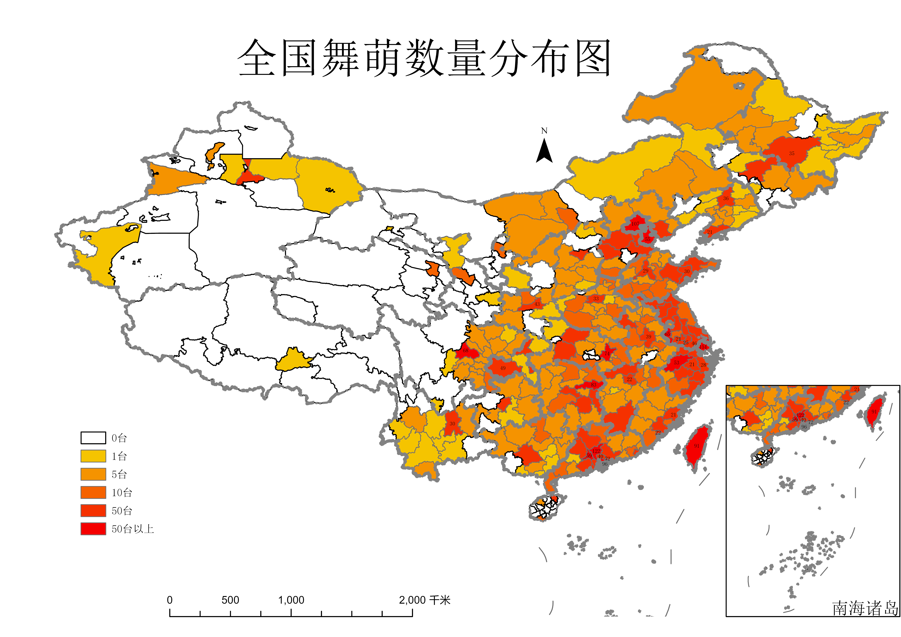

# 舞萌地图

# 中二节奏地图

## 一些工作流
`crawl.py`从全国音游地图获取数据，并保存所有`html`档案
转换成`combined_result_chunithm.json`
转换成`*.csv`
转换成`*.xls`
导入到arcgis进行地图制作
## tips
连接属性表之后需要记得导出`shp`，无法直接修改外键

## 参考
数据来源 : [全国音游地图](https://map.bemanicn.com/)
地图矢量数据来源 :[ChinaAdminDivisonSHP](https://github.com/GaryBikini/ChinaAdminDivisonSHP)

